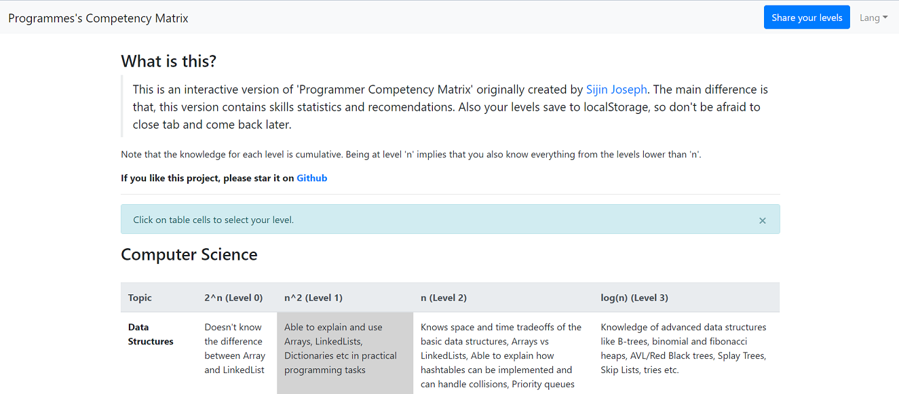

# Interactive 'Programmer's Competency Matrix' with Vue

> This is an interactive version of 'Programmer Competency Matrix' originally created by [Sijin Joseph](https://sijinjoseph.netlify.app). The main difference is that, this version contains skills statistics and recomendations. Also your levels saved to localStorage, so don't be afraid to close tab and come back later.

[Live Demo](https://cuamckuu.github.io/index.html)

# Screenshoot




## Build Setup

``` bash
# install dependencies
npm install

# serve with hot reload at localhost:8080
npm run dev

# build for production with minification
npm run build
```

# Contribute

Feel free to contact me via [telegram](http://t.me/cuamckuu) or open an issue.
